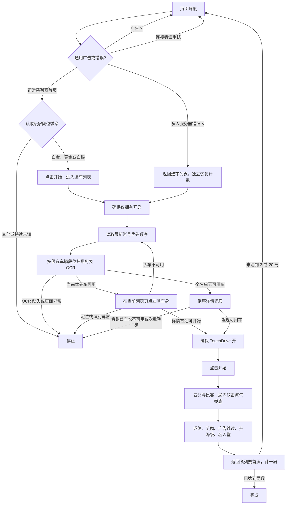

# 当前多人循环模型

本页描述当前生成的 3 局、20 局试跑任务。账号车库和九段位优先顺序由 GUI 保存；**正式循环当前可在系列赛首页确认白金、黄金、白银三个玩家段位**。每局结束后重新读首页徽章，升降级可在这三个分支间切换；其余玩家段位尚无首页徽章分支，会停止。

选车列表是线性的：青铜为左边界，传奇为右边界，**不会从传奇回到青铜**。段位按钮跳到该段位起点；手势向左沿列表向高段位移动，手势向右反向移动。白金及其以下的推荐车可以通过列表 OCR 搜索；每次点击前都会重新识别卡片，不依赖“固定滑动次数等于固定页数”。传奇没有下一段位作为右侧锚点，指定车辆的“从传奇终点”测试实际改从传奇起点向左滑动搜索，并在报告中标出有效起点。

倒序兜底是另一条路径：从当前玩家段位的**下一段位起点**进入详情，使用详情页左箭头逐辆向低段位遍历。详情页会循环，即青铜首车再向左可到传奇末车；因此在青铜首车不可用时必须停止，另有总切车次数上限。详情遍历会看到未拥有、缺图纸车辆，必须逐辆跳过。不能把详情页的循环行为用于选车列表。

广告关闭优先于其他页面动作。多人服务器错误关闭后恢复到选车列表，并重新跑独立的选车节点；不把错误算作完成一局。服务器弹窗未消失时最多重试关闭八次。列表中零燃油的优先车会直接跳到下一辆的正向搜索。推荐扫描发生无法确认的 OCR、页面变化或点击失败时，当前策略停止并记录错误；若画面是服务器错误弹窗则转到恢复分支。三局和二十局任务都按局数有界；当前没有长时运行计时器。

独立的“指定车辆定位测试”不属于上图的开赛路径。它可以从段位起点或可用的终点锚点重复搜索，最终停在目标详情页，绝不点击比赛开始。实机连接不可用时，列表边界的实际滑动距离、不同车辆详情 OCR、服务器错误恢复及长时间运行仍需设备验证。
