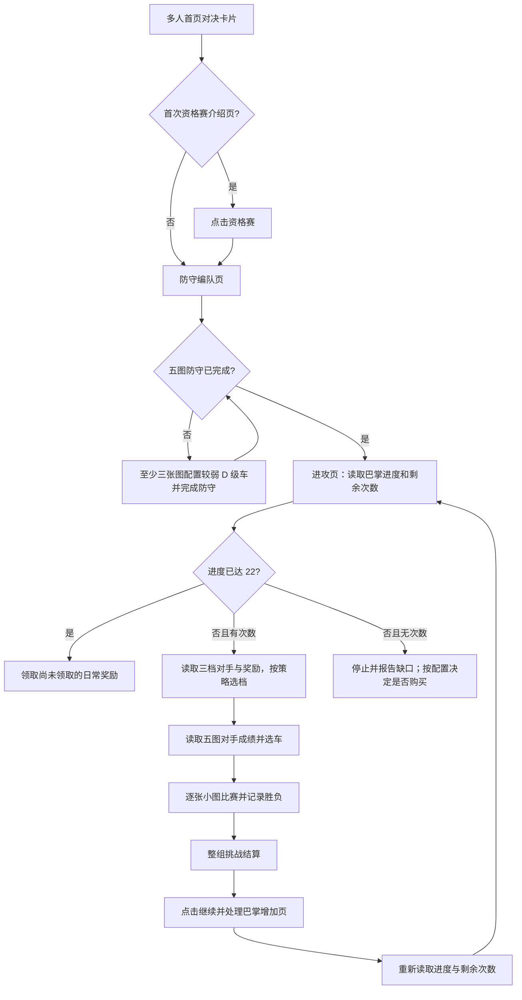

# 对决（擂台）日常自动化模型

当前代码实现擂台入口、资格赛防守编队页识别和五张赛道的查看/进入选车导航；进攻、自动驾驶、领奖与购买次数尚未接入。下面的规则以玩家确认的信息为准，尚未实机验证的界面行为另行标明。

## 已知规则与状态

- 对决位于多人游戏首页，与经典系列赛并列。每周首次进入可能先显示资格赛介绍页，平时可以直接进入防守编队页。
- 每名玩家需要在五张地图上建立防守成绩。地图由大地图和小地图组成，名字会变化。完成五张防守是进入进攻流程的前置条件，防守成绩本身不是本项目的优化目标。
- 每周刷新后的首次防守不消耗票券。若本周已尝试过防守，约九小时后票券会变为无限状态，刷新倒计时显示为 `0`；在此前的刷新等待期内再次打进组防守才会消耗票券。资格赛阶段不必预先记录票券状态，进组后再按界面读取。
- 玩家计划在进组前的五场资格赛中完成“下防”：至少为三个防守位置选择较弱的 D 级车，其余两个位置保留可配置。进组后通常不重打防守，也不点击“提升”。这是玩家选车策略；不能仅凭配置假定三档对手的实际难度或胜率会下降。
- 进攻有从左到右三档，获胜分别增加 2、3、5 个“巴掌”；失败增加 1 个。成功和失败都消耗一次挑战机会。
- 进攻一次挑战包含五张小图；至少赢三张才算整组获胜。五张图打完后，按整组胜负结算一次挑战机会和对应巴掌。
- 每日累计 22 个“巴掌”可领完日常奖励。每天早上 08:00 刷新挑战次数：五次免费挑战，另可购买五次机会。刷新采用何种服务器时区、购买价格、断线或平局如何计数，尚待验证。

## 平板参考截图中已看到的页面

目前十二张 JPEG 保存在 [`captures/reference_tablet/duel/`](../../../captures/reference_tablet/duel/)，分辨率均为 1567×1080。这些是流程参考图，不参与当前 MuMu 的 1280×720 模板匹配。

- `01`、`02` 为资格赛防守的单图赛后页：左上显示“比赛#N 已完成”，底部逐场出现绿色对勾，右下“下一场比赛”进入后续小图。赛道、车辆、时间、经验和进度数字均可变。第五张图后进入整组结算，而不是再点击“下一场比赛”。
- `03`、`04` 为进攻单图赛后页：左上显示“比赛#N 获胜”，画面同时列出双方车辆与时间；底部赛次图标含胜负箭头、当前高亮序号，右下仍有“下一场比赛”。单图获胜不能直接当作完整进攻挑战获胜。
- `05`～`07` 为五图防守完成后的“资格赛结果”：五列显示赛道、用车和成绩；右下“完成资格赛”是进入后续状态的操作。左下“重新开始”是额外重打入口，不应作为常规继续按钮；是否消耗票券取决于本周防守与刷新状态。
- `08` 为进组后的“防御”详情：可查看五个防守位置；右下“提升”旁也有票券 `1`，不应自动点击。
- `09` 为进组后的擂台大厅/排名页（用户称“图十”，本次消息实际附图为九张）：底部有“防御”“挑战”；左下“每日挑战奖励”可展开巴掌奖励。顶部橙色票券 `0/5` 是挑战机会的候选计数区，紫色 `GP` 是另一种分数，两者不能混读。顶部“奖励”和左下“每日挑战奖励”也需分别建模。
- `10` 为进攻选车前的五图对手预览：展开位置显示对手的车、性能分和主场成绩，以及绿色“选择车辆”；其他四图收起并显示各自对手成绩与车辆。左下“自动选车”会选性能分最高的五辆车，右下“开始”在未选满时不可用。这里的对手数据可用于选车策略，但不能拿车辆图片或时间数值做页面模板。
- `11` 为进组后重打防守第五张小图时的整组“防御结果”：五行对照已有主场时间与本次时间，底部是“保持主场时间”和“提交时间”。常规下防流程在进组前的资格赛完成，不会主动进入这个页面；它只作为异常恢复或未来扩展的参考。
- `12` 为进攻第五张小图后的整组“挑战获胜”：五行显示双方车辆与成绩，下方显示 `GP` 变化，右下“继续”。点击继续后还有巴掌增加页，待补截图。整组失败页尚未见到；不能只凭五行数字颜色推断最终标题。

尚未展示进攻三档选择、整组进攻失败结算、继续后的巴掌增加页或每日巴掌展开页。已确认五张小图合成一次挑战、至少赢三张才算整组获胜。

运行状态分成 `defense` 和 `daily_attack`。`defense` 记录五个位置各自的大/小地图、指定车辆、D 级弱车数量及防守是否完成；`daily_attack` 记录界面显示的巴掌进度、免费剩余次数、已购买/剩余次数、奖励领取状态及本次运行消耗。地图名、对手分数、奖励内容均在每次进入时重新识别，不把截图中的值写死。

单次完整挑战的预计增量为 `获胜 ? 所选档位的 2/3/5 : 1`，挑战次数总是减少 1。五次免费机会中，一次失败加四次最高档获胜也只有 `1+5×4=21`，达不到 22；五次全赢最高档可达 25，四次最高档加一次最低档获胜恰好达 22。优先选择最高档是否划算，要以实际对手和胜率判断。每组五图结束后都必须重新读取页面计数，不能只按预计增量推算；计数不一致、未知页面或次数耗尽时有界停止并报告。购买挑战次数作为独立配置，默认关闭，并设置次数及费用上限。

## 实现顺序与待补证据

1. **跑通资格赛下防。** 在进组前的五图资格赛选车时验证至少三辆为已拥有、可用的低性能 D 级车；完成五场后经“资格赛结果”点击“完成资格赛”进组。零场完成的“资格赛失利”可重开空进度资格赛；常规流程不从已有成绩的结果页重开，也不点击进组后的“提升”。
2. **先做只读进攻识别。** 截完整的进攻三档页面，保留三档巴掌、对手分数、奖励、当前 `0/22` 或实际进度、免费剩余次数和领奖入口。需要知道这三档是否每次刷新，以及是否能手动换对手。
3. **跑通一场进攻闭环。** 进攻五图对手预览、单图获胜和整组获胜页已有参考；仍需整组失败、点击“继续”后的巴掌增加页和返回进攻页。计数与巴掌应在完整挑战结束后复读，平局、断线、服务器错误仍需处理。擂台能否复用现有 TouchDrive 与双击氮气兜底也需实机验证。
4. **最后处理领奖和购买。** 截各档日常奖励可领取/已领取状态、免费次数用尽页、购买确认页及买后次数；记录每次价格和可购买上限。确认 08:00 刷新是否同时重置巴掌、奖励、对手和防守成绩。

模拟器账号暂时进不了进攻页时，可以先用其他设备的完整截图建立进攻状态机与素材清单，但不能把不同纵横比的截图直接当作当前 MuMu 的运行模板。当前车辆识别要求接近 16:9，擂台模板与点击区域也按 1280×720 布局制作。对于 2388×1668 平板，按现有 720 短边等比缩放会得到约 1031×720；需要先确认游戏是否在其中使用了可裁切的 16:9 画面。若是真正的平板自适应布局，则需单独的平板布局参数、模板和点击坐标，并在该设备上通过 ADB 验证。

当前最有价值的下一组素材是：**进攻三档选择页、整组结算点击“继续”后的巴掌增加页、每日挑战奖励展开页**；整组失败页遇到时再补。请保留完整原图、不裁边，便于判断 UI 布局和坐标映射。购买与自动领奖可以等进攻闭环跑通后再接。

五图互斥选车的数据来源、离线规划命令和当前未接入的部分见[擂台五图选车规划](duel_selection.md)。
