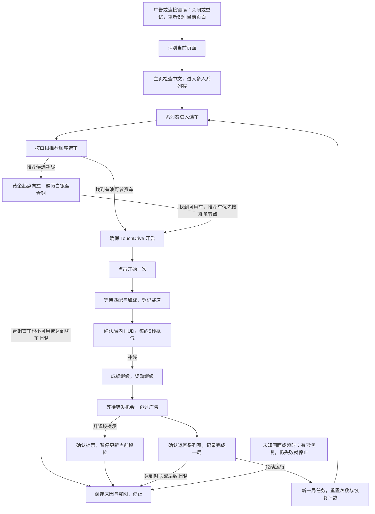

当前可执行循环已改为每局从系列赛首页徽章自动确认白金/黄金/白银，见 [动态段位与兜底](dynamic_league.md)。以下保留最初模型说明，实际入口与限次以生成后的 Pipeline 为准。

# 多人长时运行模型

2026-09-16 更新：已新增无需 Agent 的连续 3/20 局白银有界试跑任务，白银推荐顺序、倒序兜底、自动开始、氮气和结算已连接。通过每局独立节点名称隔离点击计数；这是模型的首个试跑实现，不含模型中完整计时、统计和动态恢复控制器。具体启动方式见 multiplayer_loop_test.md。下文保留设计目标与最初状态说明，以实际试跑说明为准。

这是待接入的循环模型，不是已经可运行的长时任务。当前固定白银，向下兼容青铜。黄金推荐轮换仍是旧独立任务，白银素材已整理但推荐轮换尚未生成。

启动和异常恢复均按页面调度：已经在比赛中应接局内；已经在奖励页应接奖励结算；系列赛或选车页应接对应步骤。不能为了统一入口从比赛页按返回或房子。

## 每局规则

- 推荐车缺油、未拥有或不可参赛就跳到下一候选；名单耗尽才走倒序兜底。搜索未命中单独记为“未找到”，不能当作缺油。
- 倒序兜底从黄金起点进入 Asterion 详情，向左到白银末尾；跳过未拥有或缺油车辆，自然进入青铜。遍历遇到已识别推荐车且可用，直接接该车准备节点，不重跑推荐名单。有油的非推荐车也可作为兜底。青铜首车先检查是否可用，明确不可用才停止，不再绕回。
- 点击开始前重新确认可参赛和 TouchDrive 开；进入加载后不重复点击开始。已进入局内再恢复时，不重新选车。
- 赛道识别失败不阻断通用氮气兜底。现阶段没有赛道百分比操作；每次氮气点击需要新的 HUD 识别，不能使用连续重复点击动作绕过画面检查。
- 成绩 → 奖励 → 等待错失机会 → 返回系列赛；可跳过未出现的页面。降级提示先确认，再暂停人工更新段位。升段提示还需要识别素材，未覆盖时按未知页面停止。
- 只有确认返回系列赛才累计一局完成。每局创建新的任务实例，使选车、开始、继续和确认等节点的 max_hit=1 不影响下一局。不能简单把返回节点接到同一任务入口无限循环。

## 长时保护与日志

初轮设备测试采用“60 分钟或完成 20 局，先到即停”。加载最多 180 秒；单局局内最多 300 秒；结算每阶段最多 60 秒；未知画面等待 15 秒后保存截图并尝试恢复。本局恢复最多两次，持续连接错误最多重试十次，仍失败则停止。338 次倒序左切是最终次数上限，实际正常遍历应更早在青铜首车结束。全部车辆不可用时沿用配置停止，不无限重试名单。

日志记录局号、开始/结束时间、当前段位、选中车型（无法识别时保留截图）、推荐或兜底来源、搜索/切车次数、加载与比赛耗时、恢复次数、结算步骤、停止原因。单个识别候选未命中只是普通结果，不逐次生成错误截图；整个阶段超时才生成失败记录。

推广广告使用右上 ×，没有 × 的车库外观仍用领取；局内若出现推广弹窗，关闭后重新识别页面，不自动返回主页。语言切换只在主页执行。连接重试后可能重新加载，应重新定位页面，并记录当前局是否中断；没有正常结算返回证据时不累计完成局数。

## 开测前的连接点

现有主页导航、多人准备、缺油判断、TouchDrive 检查和黄金搜索已有设备验证；白银倒序提速、氮气循环、最新结算与异常恢复仍需设备验证。

还需生成白银推荐轮换，连接准备后点击开始、加载、氮气与结算，加入跨局任务控制器，并把弹窗处理改成恢复原流程而非统一回主页。原有独立测试任务继续保留。不要将这些独立任务依次循环运行来代替页面调度。

按“1 局完整循环 → 3 局连续循环 → 60 分钟/20 局 → 更长时段”验证。每一阶段检查结算只点击一次、候选与恢复次数已重置、无油能正常兜底、未知页面有明确停止原因。

机器可读模型：`data/sources/multiplayer_loop_model.json`。
